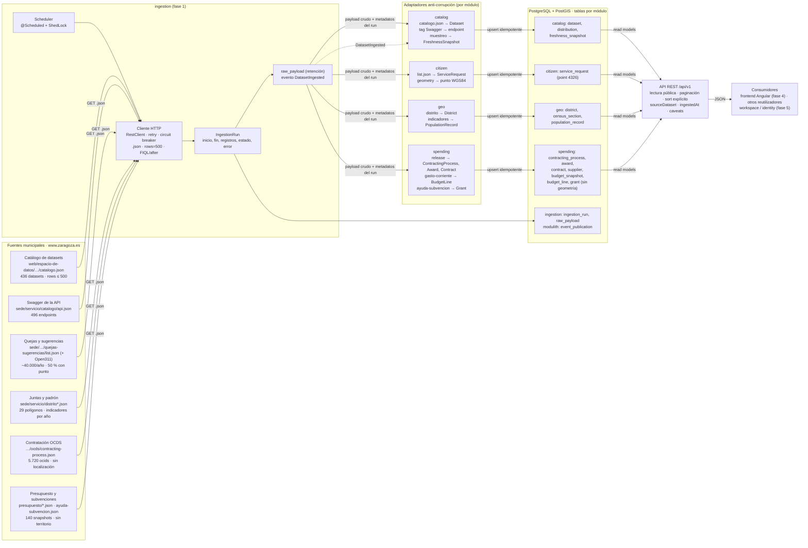
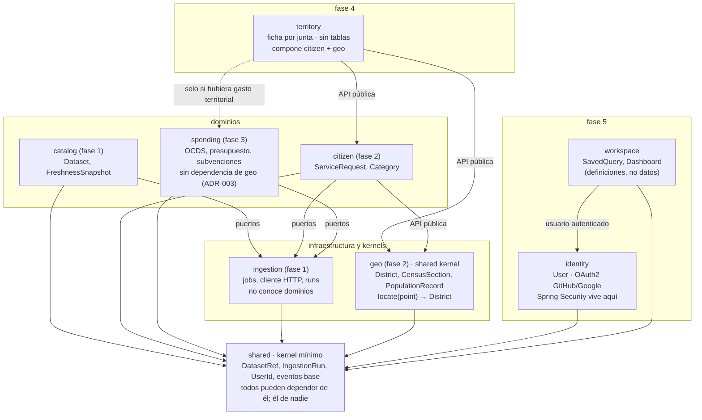
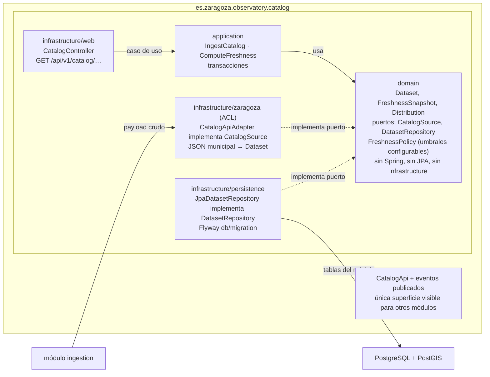

# Arquitectura

Versión gráfica de `SPEC.md` §4 tras la fase 0 (2026-09-05). Tres vistas: cómo fluyen los datos desde la API municipal hasta los consumidores, qué módulos hay y qué dependencias se permiten, y cómo se organiza cada módulo por dentro. Los diagramas son Mermaid (se renderizan en GitHub y en la mayoría de IDE); la misma información, con más detalle visual (tres figuras SVG y tablas de módulos y fuentes), está en la página publicada al cerrar la fase 0: <https://claude.ai/code/artifact/b85ed54d-61c1-4133-b6e3-abb5e0743acd> (privada; se comparte desde el menú de la propia página). Si cambian los módulos o el flujo, actualizar los dos: este fichero y la página.

## 1. Flujo de datos

Flujo de una ingesta (SPEC.md §4.5): (1) el scheduler dispara un job para un `DatasetRef`; (2) `ingestion` consulta la fuente con la estrategia incremental de esa fuente (FIQL por fecha, `after`, o recarga completa; `If-Modified-Since` no sirve, S0.5); (3) pagina con `rows`/`start` o ventanas, aplica retry y circuit breaker y entrega los payloads crudos al adaptador del módulo; (4) el adaptador traduce y persiste con upsert idempotente por identificador de origen; (5) se registra el `IngestionRun` y se publica `DatasetIngested`; (6) `catalog` escucha todos los `DatasetIngested` para el monitor de frescura.

## 2. Módulos Modulith y dependencias permitidas

Reglas (SPEC.md §4.3, verificadas con `ApplicationModules.verify()`): ningún módulo accede a tablas ni clases internas de otro; la comunicación entre dominios es por eventos; `workspace` no depende de ningún dominio; `territory` no tiene tablas y nadie depende de él; `spending` no depende de `geo` porque ninguna fuente de gasto tiene territorio (ADR-003).

## 3. Dentro de un módulo (hexagonal), con `catalog` como ejemplo

ArchUnit (`HexagonalArchitectureTests`): `domain` no importa `org.springframework`, `jakarta.persistence`, `application` ni `infrastructure`; `application` no importa `infrastructure`. El adaptador anti-corrupción es obligatorio: el dominio nunca refleja la forma del JSON municipal; si el esquema upstream cambia, cambia solo el adaptador.
