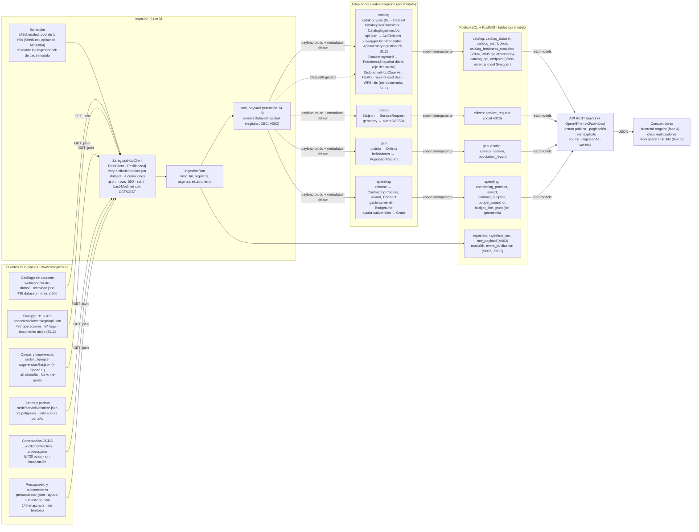
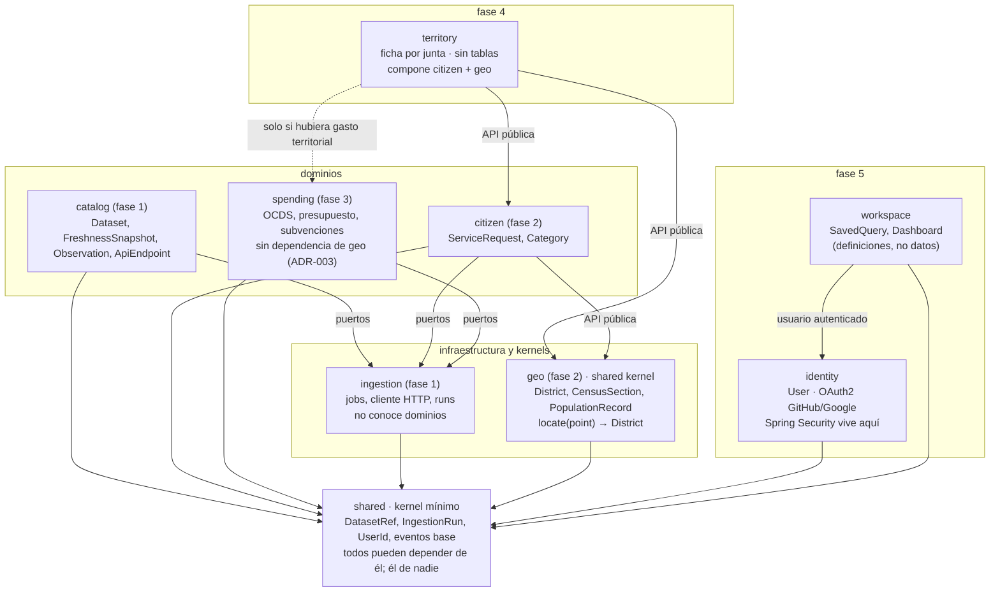
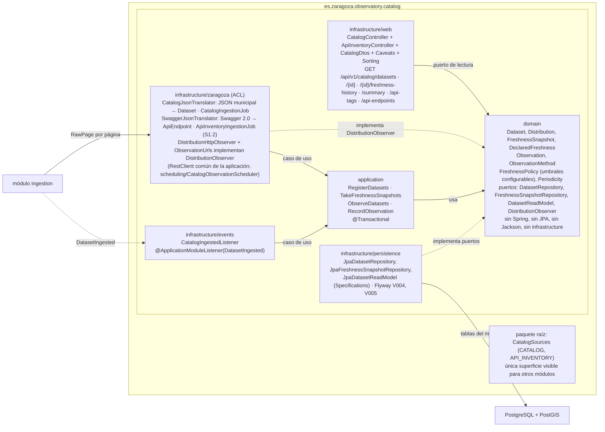

# Arquitectura

Versión gráfica de `SPEC.md` §4 tras la fase 0 (2026-09-05). Tres vistas: cómo fluyen los datos desde la API municipal hasta los consumidores, qué módulos hay y qué dependencias se permiten, y cómo se organiza cada módulo por dentro. Los diagramas son Mermaid (se renderizan en GitHub y en la mayoría de IDE); la misma información, con más detalle visual (tres figuras SVG y tablas de módulos y fuentes), está en la página publicada al cerrar la fase 0: <https://claude.ai/code/artifact/b85ed54d-61c1-4133-b6e3-abb5e0743acd> (privada; se comparte desde el menú de la propia página). Copia local completa de esa página: [`docs/arquitectura.html`](arquitectura.html) (abrir con doble clic). Si cambian los módulos o el flujo, actualizar los tres: este fichero, el HTML y la página publicada.

## 1. Flujo de datos

Flujo de una ingesta (SPEC.md §4.5, implementado en fase 1): (1) el scheduler recorre los beans `IngestionJob` que declara cada módulo y ejecuta los vencidos según su `interval()`; (2) `RunIngestion` abre un `IngestionRun` y pide páginas a `ZaragozaHttpClient` con la estrategia del `SourceDescriptor` (`OFFSET` por `start` hasta agotar `totalCount` o recibir página corta; `NONE` una sola petición; `DOCUMENT` un documento único sin parámetros de paginación, el Swagger de la API, S1.2; `If-Modified-Since` no sirve, S0.5); (3) cada página se guarda en `raw_payload` y se entrega al `handle()` del job; (4) el job traduce con su adaptador anti-corrupción y persiste con upsert idempotente por identificador de origen; (5) el cierre del run y la publicación de `DatasetIngested` van en una sola transacción (`CompleteIngestionRun`), y Modulith registra el evento en `event_publication`; (6) `catalog` escucha `DatasetIngested` con `@ApplicationModuleListener` y, tras cada ingesta del catálogo, toma la instantánea diaria de frescura de todas las fichas.

## 2. Módulos Modulith y dependencias permitidas

Reglas (SPEC.md §4.3, verificadas con `ApplicationModules.verify()`): ningún módulo accede a tablas ni clases internas de otro; la comunicación entre dominios es por eventos; `workspace` no depende de ningún dominio; `territory` no tiene tablas y nadie depende de él; `spending` no depende de `geo` porque ninguna fuente de gasto tiene territorio (ADR-003).

## 3. Dentro de un módulo (hexagonal), con `catalog` como ejemplo

ArchUnit (`HexagonalArchitectureTests`): `domain` no importa `org.springframework`, `jakarta.persistence`, `org.hibernate`, `tools.jackson`, `io.github.resilience4j`, `application` ni `infrastructure`; `application` no importa `infrastructure`, JPA, Spring Web ni Spring Data; el paquete raíz de un módulo no depende de `application` ni `infrastructure`. El adaptador anti-corrupción es obligatorio: el dominio nunca refleja la forma del JSON municipal; si el esquema upstream cambia, cambia solo el adaptador (y su test contra el fixture lo delata).

El módulo `ingestion` sigue la misma estructura: raíz (`SourceDescriptor`, `RawPage`, `IngestionJob`, `Ingestion`, `IngestionRunSummary`, `RunStatus`), `domain` (`IngestionRun`, `RawPayload`, `SourceAccessException`, puertos `SourceGateway`, `IngestionRunRepository`, `RawPayloadStore`, `IngestionEventPublisher`), `application` (`RunIngestion`, `CompleteIngestionRun`, `IngestionService`, `PurgeRawPayloads`) e `infrastructure` (`zaragoza/ZaragozaHttpClient` + `LastModifiedParser`, `persistence` JPA con V003, `events`, `scheduling/IngestionScheduler`, `IngestionConfiguration` + `IngestionProperties`).
